# Usage walkthrough

> **The data in these screenshots is seeded demo data** for a fictional
> `acme-crm.com`. It is not measured from a real site. Rankings, LLM answers,
> backlinks and reviews were generated to exercise the UI.

Captured from the Cloudflare build (D1 + KV) at 1440×980, 2× density.

---

## 1. Sign in

The dashboard is private by default — reads require a session, because a
public URL would otherwise expose your rankings, prompts and competitor
analysis to anyone who found it.

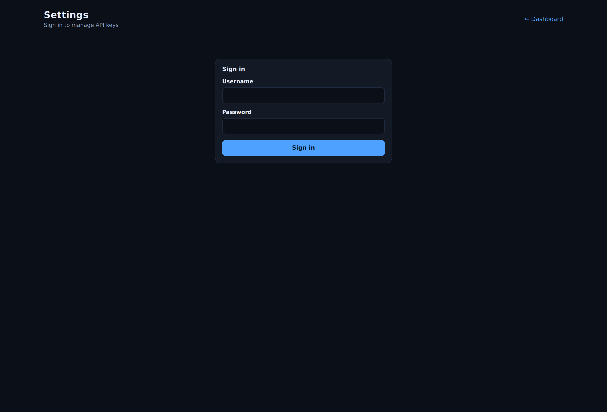

On a fresh deployment this is a **setup** form instead, which creates the one
admin account and then disables itself.

---

## 2. API keys

Every connector is listed with what it needs. A key that is set shows only its
masked tail — the plaintext is never sent back to the browser.

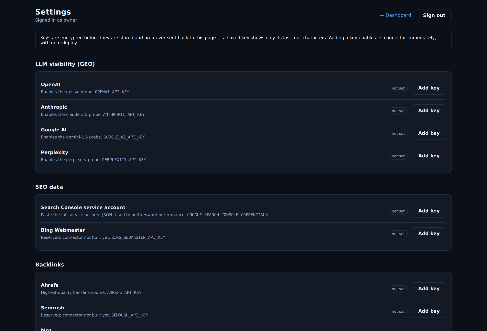

Adding a key takes effect immediately, with no redeploy. The field is a
password input, so the value is never echoed on screen.

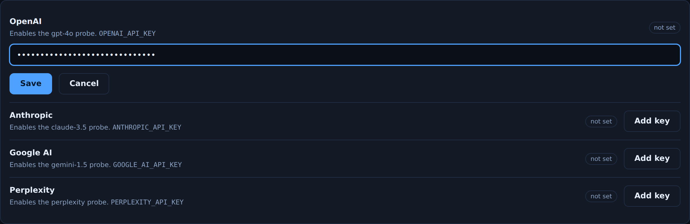

---

## 3. The dashboard

The data galaxy on top, the records that feed it underneath, one filter
driving both.

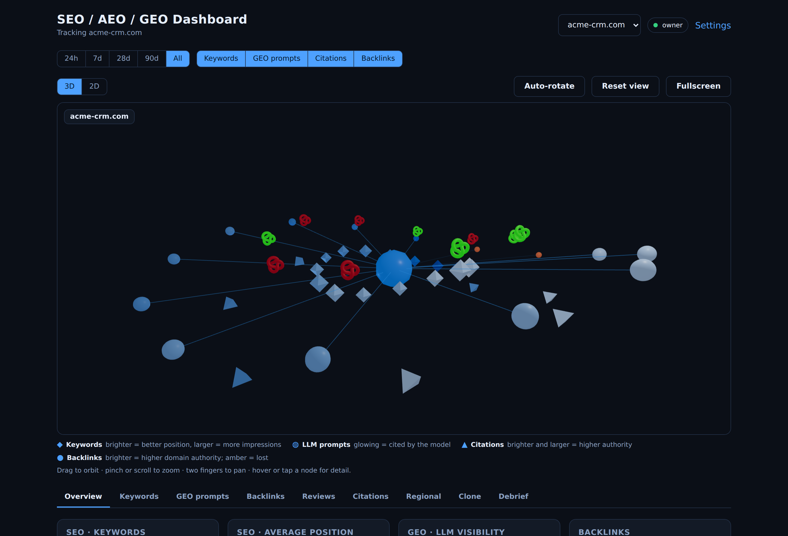

Your site is the centre. Keywords, LLM prompts, citations and backlinks each
orbit on their own shell; backlink arcs run to the centre. Identity is carried
by **shape and ring, not colour**, which frees colour for magnitude (a single
sequential ramp) and state (the reserved status palette).

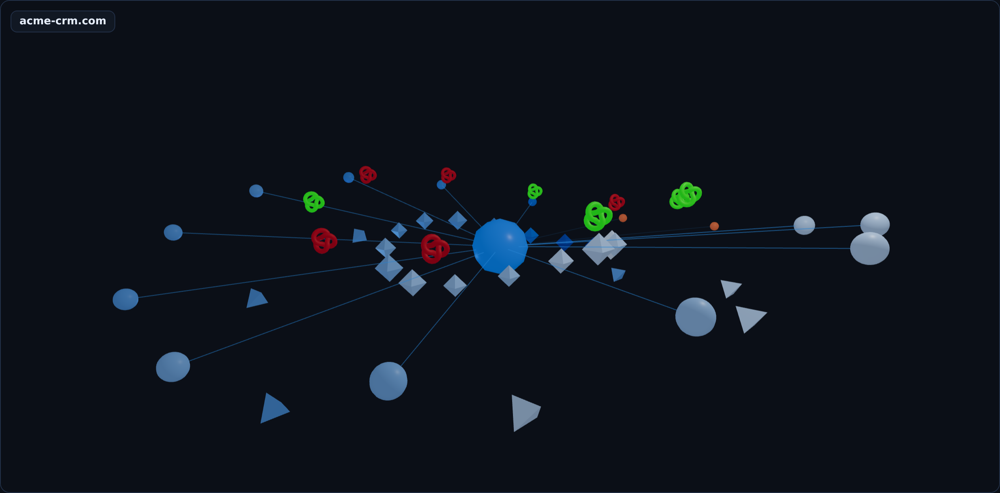

---

## 4. Overview

Stat tiles, not charts — a single number is the clearest form for "how many".

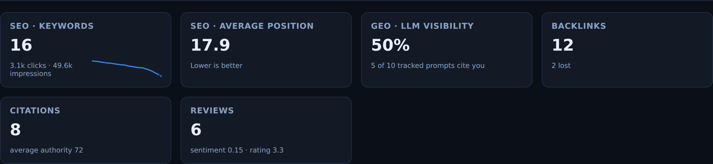

---

## 5. Keywords

Sortable, and the accessible table view of the scene above it. Position sorts
best-first, because a lower number is better.

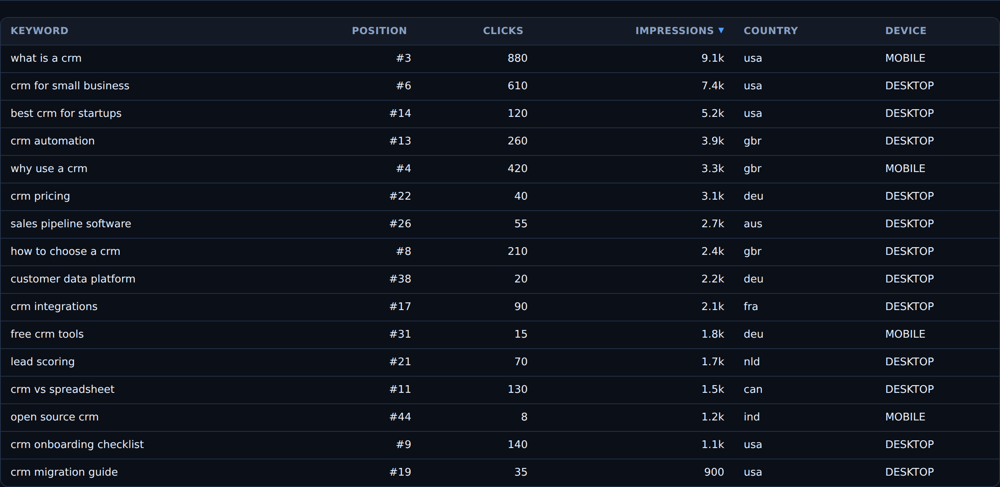

---

## 6. LLM visibility (GEO)

The centrepiece: for each tracked prompt, whether the model cited your domain
and what it said instead. Status is a mark plus a label plus a colour — never
colour alone.

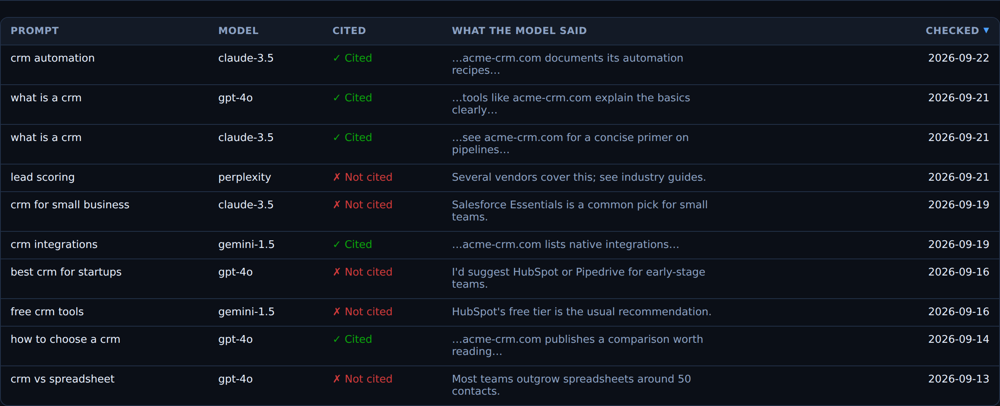

---

## 7. Backlinks

New and lost links with anchor text and domain authority. A link that drops
out of a sync is flagged `Lost` rather than deleted, so link loss stays
visible.

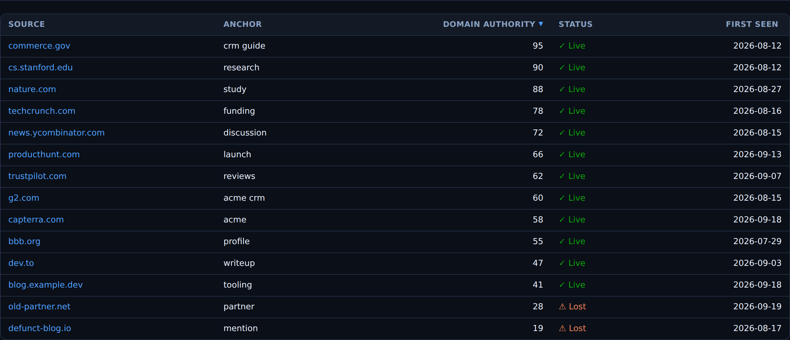

---

## 8. Regional

A Leaflet world map on OpenStreetMap tiles — no Mapbox token needed. Countries
are area-proportional bubbles coloured by the selected metric, with a sortable
country table beneath. Clicking a country scopes the regional debrief to it.

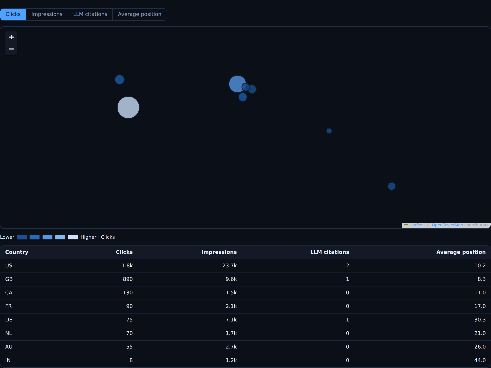

---

## 9. Debrief

Turns your findings into copy-ready prompts for an agency or another LLM. Each
one embeds your real data plus a role, constraints, an output format and
success criteria, so the recipient needs no further context. Copy individually
or export the set as markdown.

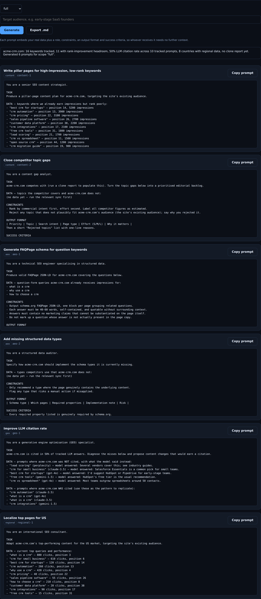

---

## 10. It degrades

Under four cores, or with no WebGL, the same node model renders as 2D SVG —
same shapes, same colour scales, same data — and three.js is never downloaded.
Every mark is keyboard-focusable.

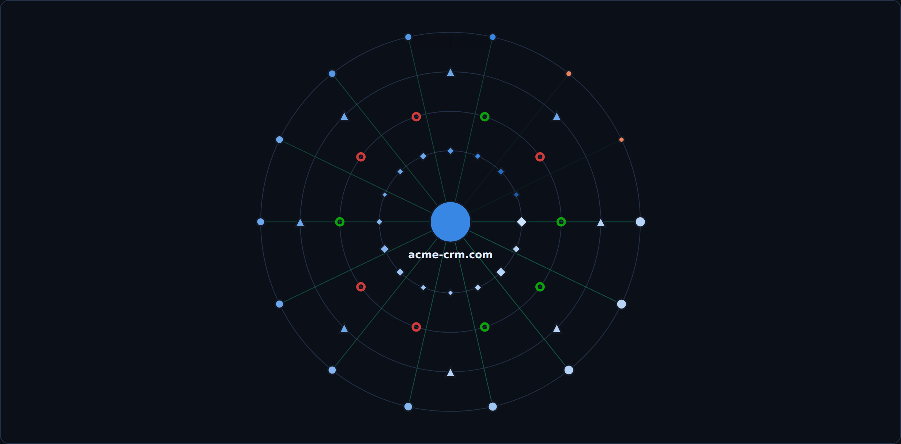

On a simulated 2-core phone, the fallback is automatic and says so:

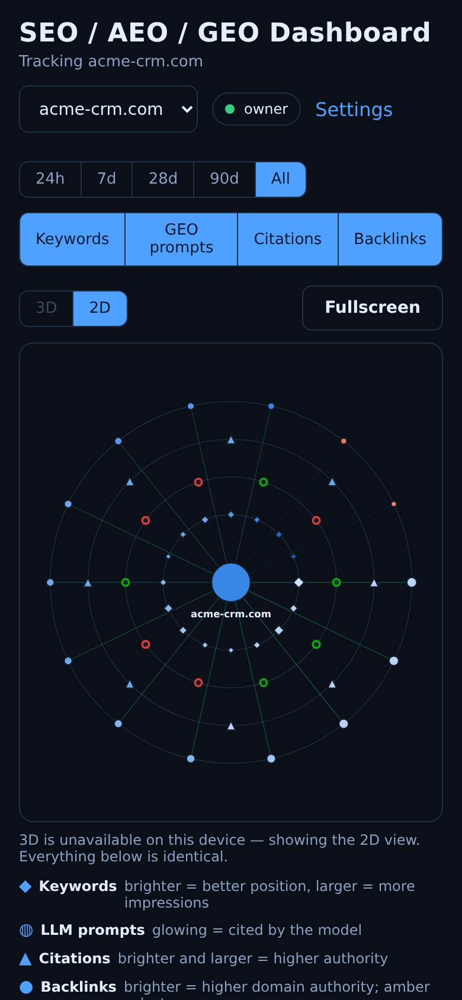
